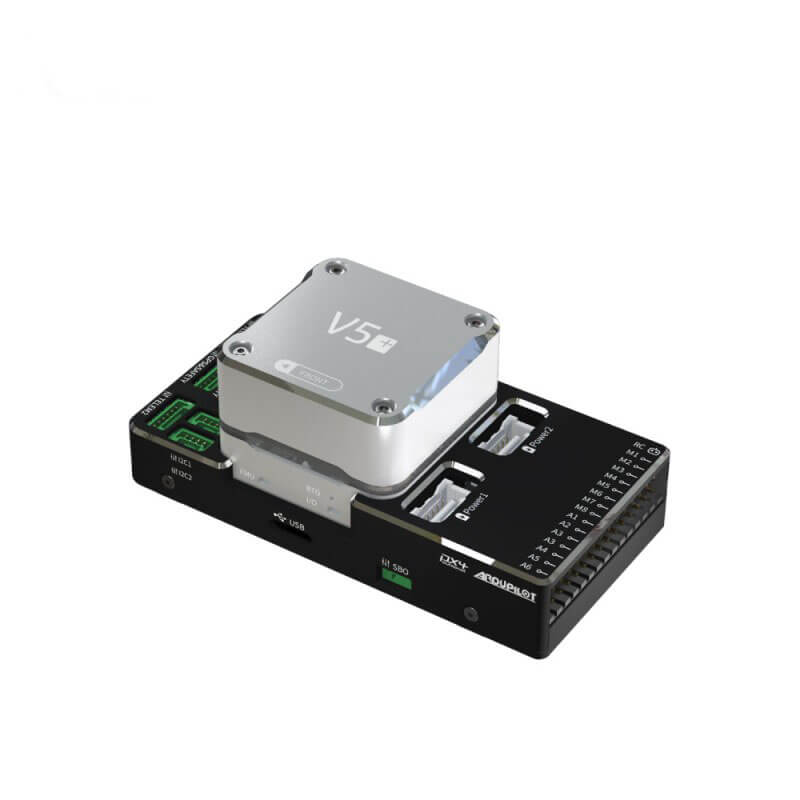
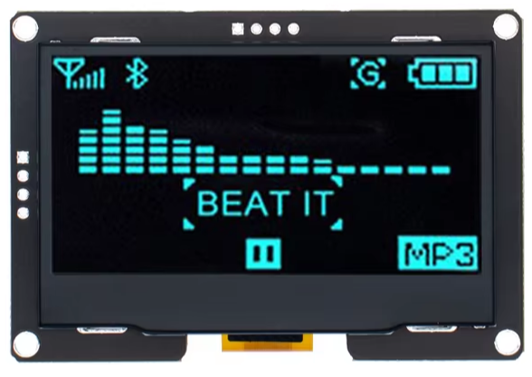

# Куб

CUAV V5+ Autopilot Pixhack PX4 APM Flight Controller

{: style="width:50%"}

# Прошивка

ArduPilot 4.5.7

## WiFi

ssid: DroneBridge ESP32
pass: 12345678

## Frame class and type

Setup -> Mandatory Hardware -> Frame Type -> X

## GPS

Настроить до калибровки компаса!

[NEO 3 Pro GPS](../../settings/equipment/GPS/NEO_3_Pro_GPS.md)

## OLED Dosplay

2.42" inch 128x64 OLED LCD Display Module SSD1309 12864

{: style="width:25%"}

**NTF_DISPLAY_TYPE**:1 (ssd1306)

**требуется перезагрузка!**

## Compass

Setup -> Mandatory Hardware -> Compass

## Accel Clibration

Setup -> Mandatory Hardware -> Accel Clibration -> Calibrate Accel

**требуется перезагрузка!**

## Gyro

Setup -> Mandatory Hardware -> Accel Clibration -> Calibrate Level

## Initial Tune Params

Airscrew size in inch: 10 (размер пропа в дюймах)
Battery cell count: 4

[Initial Tune Params](../../settings/initial_tune_params.md)

## Battery Monitor

Setuo -> Optional Hardware -> Battery Monitor:

Monitor: Analog Voltage and Current
Sensor: 8:CUAV HV PM
Ver AMP: 0: CUAV V5/Pixhawk 4 or APM1

Коэфицент корекции:
BATT_AMP_PERVLT 57,93103

## ESC Calibration

BLHELI_32 DShot 40A ESC

Setup -> Mandatory Hardware -> Esc Calibration

ESC Type: DShot1200

> после устнойка протокола требуется калибровка ESC (таким образом в частотники прописывается протокол)

## Настройка каналов

Для начала необходимо откалибровать каналы

Setup -> Mandatory Hardware -> Radio Calibration

Далее повесить на каналы следующие режимы:

Config -> User Params

* 7й канал: Motor Emerhency Stop
* 8й канал: ArmDisarm (4.2 and higher)

Далее на 5й канал настроить режимы полётов:

Setup -> Mandatory Hardware -> Flight Modes

* Flight Mode 1: Auto
* Flight Mode 2: Stabilize
* Flight Mode 3: AltHold
* Flight Mode 4: Loiter
* Flight Mode 5: FlowHold
* Flight Mode 6: Land

## Sonar Range

[TFmini Plus lidar](https://ardupilot.org/copter/docs/common-benewake-tfmini-lidar.html)

Подключён на TELEM2 (flow control)

* **SERIAL2_PROTOCOL** = 9 (Lidar) (RangeFinder)
* **SERIAL2_BAUD** = 115 (115200 baud)
* **RNGFND1_TYPE** = 20 (Benewake-Serial)
* **RNGFND1_MIN_CM** = 30 for TFmini, =10 for TFminiPlus
* **RNGFND1_MAX_CM** = 1000 for indoor use OR 600 for outdoors. This is the distance in centimeters that the rangefinder can reliably read.
* **RNGFND1_GNDCLEAR** = 10 or more accurately the distance in centimetres from the range finder to the ground when the vehicle is landed. This value depends on how you have mounted the rangefinder.
* **RNGFND1_GNDCLEAR** = 16

**требуется перезагрузка!**

## EKF

**EK3_SRC1_POSZ** 2 (RangeFinder)

## Виртуальный забор

* **FENCE_ENABLE**: 1
* **FENCE_RADIUS**: 5 m
* **FENCE_ALT_MAX**: 3 m
* **FENCE_ALT_MIN**: -10
* **FENCE_ACTION**: 1 (rtl or land)

## Настройка ВМГ(Винтомоторной группы)

> **NOTE**
> Проверить расположение пропелеров, их ориентацию и направление вращение

[расположение пропелеров](../../settings/vmg.md)

Проверить вращение моторов

Setup -> Optional Hardware -> Motor Test

* **MOT_SPIN_ARM**: 0 (не вращаять пропы после арминга)
* **MOT_SPIN_MAX**: 0,95
* **MOT_SPIN_MIN**: 0,15

> Если перепутаны моторы, то можно ремаппинг выполнить в Setup -> Mandatory Hardware -> Servo Output

> Если перепутан канал по тангажу (pitch), то RC2_REVERSED установить в 1

## Автовзлёт

[Автовзлёт](../../settings/takeoff.md)

Задать WP 2

**PILOT_TKOFF_ALT**: 200

## Максимальный угол наклона

Задать максимальный угол наклона во всех режимах полета

**ANGLE_MAX**: 1500

## ----

MOT_HOVER_LEARN
