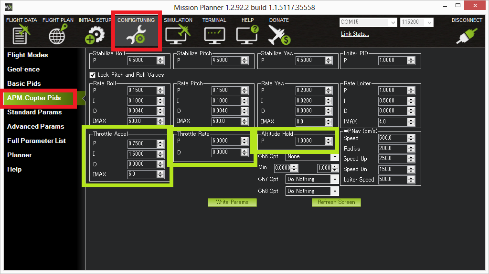
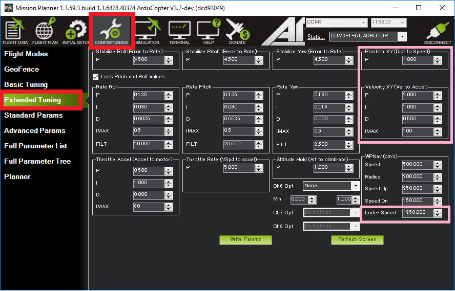

# Настрока PID'ов

Rate - это реакция на стики

## Initial aircraft tune

[Initial Tuning Flight](https://ardupilot.org/copter/docs/initial-tuning-flight.html)

1. Arm the aircraft in STABILIZE
2. Increase the throttle slowly until the aircraft leaves the ground
3. If the aircraft starts to oscillate immediately abort the takeoff and/or land the aircraft
4. Reduce all the following parameters by 50%

* [ATC_RAT_PIT_P](https://ardupilot.org/copter/docs/parameters.html#atc-rat-pit-p-ac-attitudecontrol-multi): Pitch axis rate controller P gain
* [ATC_RAT_PIT_I](https://ardupilot.org/copter/docs/parameters.html#atc-rat-pit-i-ac-attitudecontrol-multi): Pitch axis rate controller I gain
* [ATC_RAT_PIT_D](https://ardupilot.org/copter/docs/parameters.html#atc-rat-pit-d-ac-attitudecontrol-multi): Pitch axis rate controller D gain
* [ATC_RAT_RLL_P](https://ardupilot.org/copter/docs/parameters.html#atc-rat-rll-p-ac-attitudecontrol-multi): Roll axis rate controller P gain
* [ATC_RAT_RLL_I](https://ardupilot.org/copter/docs/parameters.html#atc-rat-rll-i-ac-attitudecontrol-multi): Roll axis rate controller I gain
* [ATC_RAT_RLL_D](https://ardupilot.org/copter/docs/parameters.html#atc-rat-rll-d-ac-attitudecontrol-multi): Roll axis rate controller D gain

This process is repeated until the aircraft can hover without oscillations being detectable visually or audibly.

## Test AltHold
This test will allow to test the altitude controller and ensure the stability of your aircraft.

1. Check [MOT_HOVER_LEARN](https://ardupilot.org/copter/docs/parameters.html#mot-hover-learn) is set to 2. This will allow the controller to learn by itself the correct hover value when flying.

        MOT_HOVER_LEARN: Hover Value Learning
        0 - Disabled
        1 - Learn
        2 - Learn and Save

2. Take off in STABILIZE and increase altitude to 5m. Switch to AltHold and be ready to switch back to STABILIZE. If the aircraft is hovering at a very low hover throttle value you may hear a reasonably fast oscillation in the motors. Ensure the aircraft has spent at least 30 seconds in hover to let the hover throttle parameter converge to the correct value. Land and disarm the aircraft.
3. Set these parameters on ground and preferably disarm (A confident pilot could set them in flight with GCS or CH6 tuning knob):

* [PSC_ACCZ_I](#psc_accz_i) to 2 x [MOT_THST_HOVER](https://ardupilot.org/copter/docs/parameters.html#mot-thst-hover)
* [PSC_ACCZ_P](#psc_accz_p) to [MOT_THST_HOVER](https://ardupilot.org/copter/docs/parameters.html#mot-thst-hover)

        MOT_THST_HOVER: Thrust Hover Value
        Motor thrust needed to hover expressed as a number from 0 to 1
        Range 0.125 to 0.6875

if AltHold starts to oscillate up and down the position and velocity controllers may need to be reduced by 50%. These values are: [PSC_POSZ_P](https://ardupilot.org/copter/docs/parameters.html#psc-posz-p) and [PSC_VELZ_P](https://ardupilot.org/copter/docs/parameters.html#psc-velz-p).

## Параметры в интерфейсе MissionPlanner

Config -> extended Tuning

[ATC_RAT_PIT_P](https://ardupilot.org/copter/docs/parameters.html#atc-rat-pit-p-ac-attitudecontrol-multi): Pitch axis rate controller P gain
[ATC_RAT_PIT_I](https://ardupilot.org/copter/docs/parameters.html#atc-rat-pit-i-ac-attitudecontrol-multi): Pitch axis rate controller I gain
[ATC_RAT_PIT_D](https://ardupilot.org/copter/docs/parameters.html#atc-rat-pit-d-ac-attitudecontrol-multi): Pitch axis rate controller D gain
[ATC_RAT_RLL_P](https://ardupilot.org/copter/docs/parameters.html#atc-rat-rll-p-ac-attitudecontrol-multi): Roll axis rate controller P gain
[ATC_RAT_RLL_I](https://ardupilot.org/copter/docs/parameters.html#atc-rat-rll-i-ac-attitudecontrol-multi): Roll axis rate controller I gain
[ATC_RAT_RLL_D](https://ardupilot.org/copter/docs/parameters.html#atc-rat-rll-d-ac-attitudecontrol-multi): Roll axis rate controller D gain

## Altitude Hold Mode

[Altitude Hold Mode](https://ardupilot.org/copter/docs/altholdmode.html)

> The Throttle Accel PID gains convert the acceleration error (i.e the difference between the desired acceleration and the actual acceleration) into a motor output.  The 1:2 ratio of P to I (i.e. I is twice the size of P) should be maintained if you modify these parameters. These values should never be increased but for very powerful copters you may get better response by reducing both by 50% (i.e P to 0.5, I to 1.0).

> Коэффициенты усиления Throttle Accel PID преобразуют ошибку ускорения (т. е. разницу между желаемым ускорением и фактическим ускорением) в выходную мощность двигателя. Соотношение 1:2 P к I (т. е. I в два раза больше P) должно поддерживаться, если вы изменяете эти параметры. Эти значения никогда не следует увеличивать, но для очень мощных коптеров вы можете получить лучший отклик, уменьшив оба на 50% (т. е. P до 0,5, I до 1,0).

## Loiter Mode

[Loiter Mode](https://ardupilot.org/copter/docs/loiter-mode.html)

LOIT_SPEED: максимальная горизонтальная скорость в см/с (т. е. 1250 = 12,5 м/с)

LOIT_ACC_MAX: максимальное ускорение в см/с/с. Более высокие значения заставляют коптер ускоряться и останавливаться быстрее

LOIT_ANG_MAX: максимальный угол наклона в градусах (т. е. 30 градусов). По умолчанию это значение равно нулю, что приводит к использованию значения параметра PSC_ANGLE_MAX или ANGLE_MAX

LOIT_BRK_ACCEL: максимальное ускорение в см/с/с при торможении (т. е. пилот переместил стики в центральное положение). Более высокие значения остановят транспортное средство быстрее

LOIT_BRK_DELAY: задержка в секундах перед началом торможения после того, как пилот установил стики в центральное положение

LOIT_BRK_JERK: максимальное изменение ускорения в см/с/с/с при торможении. Более высокие числа позволят автомобилю быстрее достичь максимального угла торможения, более низкие числа обеспечат более плавное торможение

PSC_POSXY_P: (показано как «Position XY (Dist to Speed)» в правом верхнем углу снимка экрана выше) преобразует ошибку горизонтального положения (т. е. разницу между желаемым положением и фактическим положением) в желаемую скорость по направлению к целевой позиции. Обычно это не требуется настраивать

PSC_VELXY_P (показано как «Velocity XY (Vel to Accel)») преобразует желаемую скорость по направлению к цели в желаемое ускорение. Полученное желаемое ускорение становится углом наклона, который затем передается в тот же угловой контроллер, который используется в режиме стабилизации. Обычно это не требуется настраивать

### [PSC_POSZ_P](https://ardupilot.org/copter/docs/parameters.html#psc-posz-p):

Преобразует разницу между желаемой высотой и фактической высотой в скорость подъема или снижения, которая передается на контроллер ускорения.

### [PSC_VELZ_P](https://ardupilot.org/copter/docs/parameters.html#psc-velz-p):

Преобразует разницу между желаемой вертикальной скоростью и фактической скоростью в желаемое ускорение, которое передается на контроллер ускорения.

### [PSC_ACCZ_P](https://ardupilot.org/copter/docs/parameters.html#psc-accz-p)

Преобразует разницу между желаемым вертикальным ускорением и фактическим ускорением в выходной сигнал двигателя.

### [PSC_ACCZ_I](https://ardupilot.org/copter/docs/parameters.html#psc-accz-i)

Корректирует долгосрочную разницу между желаемым вертикальным ускорением и фактическим ускорением.
