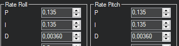
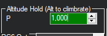
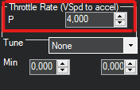
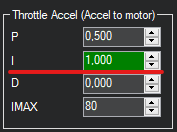
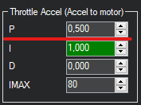

# Настрока PID'ов

Rate - это реакция на стики

## Initial aircraft tune

[Initial Tuning Flight](https://ardupilot.org/copter/docs/initial-tuning-flight.html)

1. Arm the aircraft in STABILIZE
2. Increase the throttle slowly until the aircraft leaves the ground
3. If the aircraft starts to oscillate immediately abort the takeoff and/or land the aircraft
4. Reduce all the following parameters by 50%

* [ATC_RAT_PIT_P](https://ardupilot.org/copter/docs/parameters.html#atc-rat-pit-p-ac-attitudecontrol-multi): Pitch axis rate controller P gain
* [ATC_RAT_PIT_I](https://ardupilot.org/copter/docs/parameters.html#atc-rat-pit-i-ac-attitudecontrol-multi): Pitch axis rate controller I gain
* [ATC_RAT_PIT_D](https://ardupilot.org/copter/docs/parameters.html#atc-rat-pit-d-ac-attitudecontrol-multi): Pitch axis rate controller D gain
* [ATC_RAT_RLL_P](https://ardupilot.org/copter/docs/parameters.html#atc-rat-rll-p-ac-attitudecontrol-multi): Roll axis rate controller P gain
* [ATC_RAT_RLL_I](https://ardupilot.org/copter/docs/parameters.html#atc-rat-rll-i-ac-attitudecontrol-multi): Roll axis rate controller I gain
* [ATC_RAT_RLL_D](https://ardupilot.org/copter/docs/parameters.html#atc-rat-rll-d-ac-attitudecontrol-multi): Roll axis rate controller D gain

This process is repeated until the aircraft can hover without oscillations being detectable visually or audibly.

## Test AltHold
This test will allow to test the altitude controller and ensure the stability of your aircraft.

1. Check [MOT_HOVER_LEARN](https://ardupilot.org/copter/docs/parameters.html#mot-hover-learn) is set to 2. This will allow the controller to learn by itself the correct hover value when flying.
2. Take off in STABILIZE and increase altitude to 5m. Switch to AltHold and be ready to switch back to STABILIZE. If the aircraft is hovering at a very low hover throttle value you may hear a reasonably fast oscillation in the motors. Ensure the aircraft has spent at least 30 seconds in hover to let the hover throttle parameter converge to the correct value. Land and disarm the aircraft.
3. Set these parameters on ground and preferably disarm (A confident pilot could set them in flight with GCS or CH6 tuning knob):

* [PSC_ACCZ_I](https://ardupilot.org/copter/docs/parameters.html#psc-accz-i) to 2 x [MOT_THST_HOVER](https://ardupilot.org/copter/docs/parameters.html#mot-thst-hover)
* [PSC_ACCZ_P](https://ardupilot.org/copter/docs/parameters.html#psc-accz-p) to [MOT_THST_HOVER](https://ardupilot.org/copter/docs/parameters.html#mot-thst-hover)

[MOT_THST_HOVER](https://ardupilot.org/copter/docs/parameters.html#mot-thst-hover): Hover Value Learning
0 - Disabled
1 - Learn
2 - Learn and Save

if AltHold starts to oscillate up and down the position and velocity controllers may need to be reduced by 50%. These values are: [PSC_POSZ_P](https://ardupilot.org/copter/docs/parameters.html#psc-posz-p) and [PSC_VELZ_P](https://ardupilot.org/copter/docs/parameters.html#psc-velz-p).

## Параметры в интерфейсе MissionPlanner

Config -> extended Tuning

[ATC_RAT_PIT_P](https://ardupilot.org/copter/docs/parameters.html#atc-rat-pit-p-ac-attitudecontrol-multi),
[ATC_RAT_PIT_I](https://ardupilot.org/copter/docs/parameters.html#atc-rat-pit-i-ac-attitudecontrol-multi),
[ATC_RAT_PIT_D](https://ardupilot.org/copter/docs/parameters.html#atc-rat-pit-d-ac-attitudecontrol-multi),
[ATC_RAT_RLL_P](https://ardupilot.org/copter/docs/parameters.html#atc-rat-rll-p-ac-attitudecontrol-multi),
[ATC_RAT_RLL_I](https://ardupilot.org/copter/docs/parameters.html#atc-rat-rll-i-ac-attitudecontrol-multi),
[ATC_RAT_RLL_D](https://ardupilot.org/copter/docs/parameters.html#atc-rat-rll-d-ac-attitudecontrol-multi):

[PSC_POSZ_P](https://ardupilot.org/copter/docs/parameters.html#psc-posz-p):

Преобразует разницу между желаемой высотой и фактической высотой в скорость подъема или снижения, которая передается на контроллер ускорения.

[PSC_VELZ_P](https://ardupilot.org/copter/docs/parameters.html#psc-velz-p):

Преобразует разницу между желаемой вертикальной скоростью и фактической скоростью в желаемое ускорение, которое передается на контроллер ускорения.

[PSC_ACCZ_I](https://ardupilot.org/copter/docs/parameters.html#psc-accz-i)

Корректирует долгосрочную разницу между желаемым вертикальным ускорением и фактическим ускорением.

[PSC_ACCZ_P](https://ardupilot.org/copter/docs/parameters.html#psc-accz-p)

Преобразует разницу между желаемым вертикальным ускорением и фактическим ускорением в выходной сигнал двигателя.
