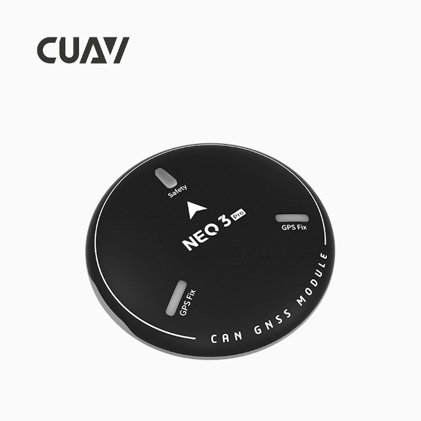

# NEO 3 Pro GPS

[NEO 3 Pro GNSS module](https://doc.cuav.net/gps/neo-series-gnss/en/neo-3-pro.html)

[NEO 3 Pro GPS](https://ardupilot.org/copter/docs/common-cuav-neo-3-pro.html)

Set the following parameters in all parameter tables of Mission planner and restart after writing

* [CAN_P1_DRIVER](https://ardupilot.org/copter/docs/parameters.html#can-p1-driver) set to 1.
* [CAN_P2_DRIVER](https://ardupilot.org/copter/docs/parameters.html#can-p2-driver) set to 1.
* [CAN_D1_PROTOCOL](https://ardupilot.org/copter/docs/parameters.html#can-d1-protocol) set to 1.
* [CAN_D2_PROTOCOL](https://ardupilot.org/copter/docs/parameters.html#can-d2-protocol) set to 1.
* [NTF_LED_TYPES](https://ardupilot.org/copter/docs/parameters.html#ntf-led-types) set to 231.
* [GPS1_TYPE](https://ardupilot.org/copter/docs/parameters.html#gps1-type) set to 9 (DroneCAN).
