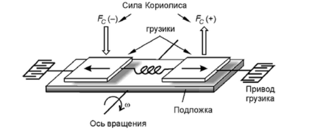
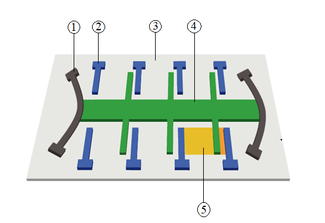

# Инерциальные измерительные модули (IMU)

## Назначение и состав IMU

Простейшей инерциальной сенсорной системой является блок инерциальных измерений (БИИ от англ. IMU — Inertial Measurement Unit). Как правило, в его состав входят гироскопы и акселерометры, позволяющие отслеживать вращательные и поступательные движения. Количество осей, по которым происходят измерения, при этом зависит от сложности выполняемых задач.
В большинстве компактных инерциальных измерительных модулей используются МЭМС компоненты (Micro Electrical Mechanical System - микромеханические электронные системы). Хотя МЭМС гироскоп не обладает точностными характеристиками лазерного гироскопа, однако он выигрывает в стоимости и компактности, к тому же даже очень точные гироскопы подвержены дрейфу и воздействию шумов, что ведёт к погрешностям измерений, поэтому для компенсации помех и повышению уровня точности в таких приборах обычно применяются фильтры единой оценки ориентации.
Самым распространенным алгоритмом определения точной ориентации на данный момент является фильтр Калмана, который позволяет учесть все погрешности измерений, возникающие при движении и вибрации.

## Инерциальный измерительный блок (IMU)

Полетный контроллер оснащен набором миниатюрных измерительных устройств (датчиков), которые лежат в основе инерциального измерительного блока.

Инерциальный измерительный блок или система инерциальной навигации (от англ. IMU – Inertial Measurement Unit) – это система, которая определяет своё положение в пространстве используя свойства инерции тел, то есть определяет на какой угол и по какой оси она была повернута и была смещена относительно начальной точки. Измерительный блок включает в себя датчики линейного ускорения (акселерометр) и угловой скорости (гироскоп). Основной задачей датчиков на полетном контроллере является непрерывное получение навигационных данных для математических расчетов микроконтроллером (микропроцессором), который устанавливает положение беспилотника относительно горизонта и обнаруживает изменения углов ориентации, относительно его предыдущего положения в пространстве, затем направляет данные в электронные регуляторы оборотов двигателей (ESC). Вычисленные данные микроконтроллером позволяют обеспечивать полет мультикоптером, управляя газом, углами крена, тангажа и рысканья (throttle, pitch, roll, yaw).

Современные датчики положения и ускорений используемые при управления беспилотными летательными аппаратами основаны на технологии микроэлектромеханических систем (МЭМС).

МЭМС (MEMS) или микроэлектромеханические системы представляет собой технологию, которая позволяет миниатюризировать механические структуры и полностью интегрировать их с электрическими схема, что приводит к одному физическому устройству, где механические и электрические компоненты работают для реализации желаемой функциональности. Таким образом, МЭМС-устройство представляет собой микро (т.е. очень маленький) чип, в котором одновременно находятся электрическая система, отвечающая за обработку сигналов и движущаяся механическая система. Физические размеры МЭМС-устройств могут варьироваться от одного микрона до нескольких миллиметров, а также от относительно простых структур практически без движущихся элементов до очень сложных электромеханических систем.

## Принцип работы интегрального гироскопа

Гироскоп (от греч. «gyros» – круг и «skopeo» – смотрю, наблюдаю) – это устройство, которые способно реагировать на изменение углов ориентации объекта, относительно инерциальной системы отсчета и определять его положение в пространстве. Схема показана на рисунке 1.

Рисунок 1 – Устройство интегрального гироскопа

Чувствительным элементом интегрального гироскопа являются две подвижные массы (грузики), которые находятся в непрерывном движении на упругом подвесе в противоположенных направлениях. Источником колебаний подвижной массы является гребенчатые электростатические двигатели. Подвижная масса, вместе с электродами, расположенная на подложке, образуют конденсаторы, входящие в состав дифференциальной схемы, вырабатывающей сигнал, пропорциональный разности емкостей конденсатора. Линейное ускорение одинаково воздействует на обе подвижные массы и подложку, поэтому сигнал на выходе дифференциальной схемы не появляется. Как только произойдет изменение угловой скорости относительно оси вращения, то на подвижные массы начинает действовать сила Кориолиса, отклоняя подвижные массы в противоположных направлениях. Соответственно, емкость одного конденсатора увеличивается, а другого уменьшается, что порождает разностный сигнал, пропорциональный величине углового ускорения. Таким образом, осуществляется преобразование угловой скорости гироскопа в электрический параметр, величина которого детектируется специальным датчиком.

Для того, чтобы мультикоптер определял положение в пространстве относительно трех ортогональных направлений х, y, и z, внутри одного корпуса микросхемы располагаются три датчика перпендикулярно осям. От сюда происходит название – трех осевой гироскоп.

## Принцип работы интегрального акселерометра

Акселерометр (от лат. «accelero» – ускоряю и греч. «metreo» – измеряю) – это устройство, которое измеряет кажущееся ускорение (разность между истинным ускорением объекта и гравитационным ускорением). В состав интегрального акселерометра входят высокоточный чувствительный элемент (движущийся) для определения ускорений и электронная часть, осуществляющая обработку сигнала (рисунок 2).

1 – Поликремниевые пружины; 2 – Фиксированные пластины (контакты); 3 – Кремниевая подложка (корпус); 4 – Подвижная масса с проводниками; 5 – Изменение емкости.

Рисунок 2 – Устройство интегрального акселерометра

На статическом корпусе (не подвижном) параллельно размещены тонкие фиксированные пластины (контакты), снимающие показания, а источником данных является подвижная масса закрепленная на упругих поликремниевых пружинах и выполнения в виде тонкой рамки с отведенными в стороны проводниками и допускающая перемещение в определенных пределах, когда к определенной оси применятся ускорение.

Отведенные в сторону проводники подвижной массы располагаются между фиксированными пластинами (контактами), через которые снимаются показания перемещения проводников. Объектом измерения выступает изменяющаяся емкость между фиксированными пластинами и проводниками подвижной массы, где изменение емкости пропорционально ускорению оси относительно который происходит движение.

 Датчик обрабатывает это изменение емкости и преобразует его в аналоговое выходное напряжение, где специальный чип, интегрированный в корпус МЭМС-устройства, его измеряет. С учетом этих данных и заранее известных массы и параметров подвижного элемента, чип выдает итоговое значение ускорения по одному из трех ортогональных направлений x, y, и z. Это значение используется микроконтроллером для автоматического выравнивания полета мультикоптера.

Интегральные акселерометры, как и гироскопы в мультикоптерах являются трехосевыми, с тремя датчика расположены внутри одного корпуса микросхемы перпендикулярно осям х, у и z.

В современных МЭМС микросхемах трехосевые акселерометры и трехосевые гироскопы часто объединяют в одном корпусе, в этом же корпусе располагается электронная часть для предварительной обработки сигналов, с внешними протоколом обмена I2C или SPI.

У IMU есть две основные характеристики, это частота работы или частота сэмплирования и чувствительность к шумам (механическим вибрациям и электрическим помехам). Чтобы частично решить проблему с возникающими механическими вибрациями, на полетный контроллер устанавливаются демпферы или пористый материал, который сможет гасить вибрацию.

I2C и SPI – это протоколы связи (BUS) между микроконтроллером и IMU. В зависимости от того, какой протокол будет выбран, будут зависеть ограничения в скорости работы IMU. При использовании SPI, появляется возможность работать с большими частотами 32KHz, в то время как с протоколом I2C лимит ограничен в 4KHz. Поэтому большинство современных полетных контроллеров используют протокол SPI.