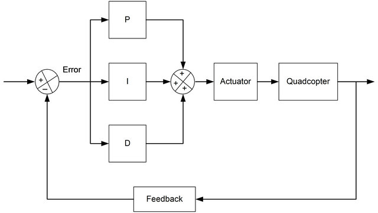
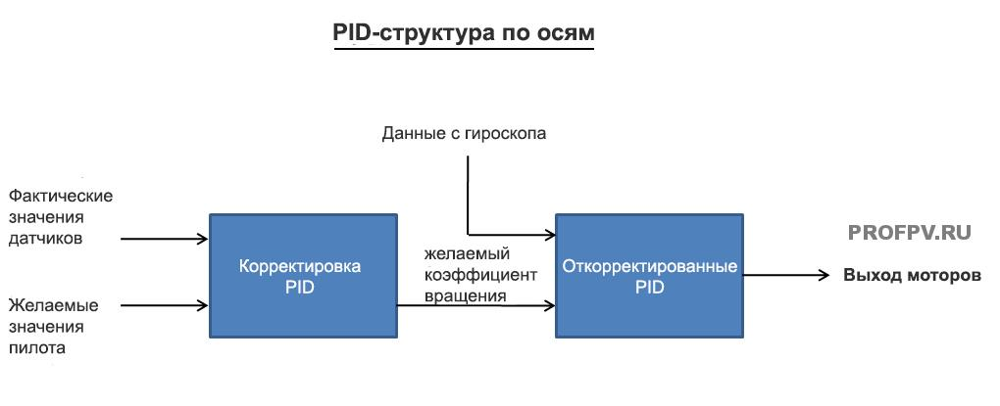
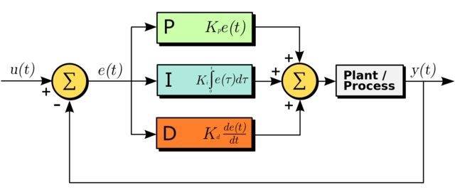

Что такое PID, на что влияет и как настроить
============================================

Многие прошивки для квадрокоптеров, такие как Betaflight и KISS, позволяют пилотам настраивать значения PID для повышения эффективности полета. В этой статье я расскажу, что такое PID, как это влияет на стабильность и обработку полёта. Также расскажу о некоторых простых методах настройки PID квадрокоптера.

Что такое PID в квадрокоптерах
------------------------------

К сожалению, в этом мире не все идеально, поэтому были придуманы PID (далее по тексту ПИД), чтобы приблизиться к идеалам.

PID — это функция в полетном контроллере. Эта функция считывает данные с датчиков и передает двигателям, как быстро им нужно вращаться. В конечном итоге, именно так достигается стабильность и идеальность полета квадрокоптера.

PID обозначает производную пропорционального интеграла. ПИД-регулятор представляет собой замкнутую систему управления, которая пытается получить фактический результат ближе к желаемому результату, внеся коррективы в выходные данные, которые отправляются двигателям. Если происходит ошибка, она возвращается в начало и цикл повторяется.

ПИД-регулятор вычисляет значение «ошибка» как разность между измеряемой величиной и желаемой величиной. Контроллер пытается свести к минимуму ошибку, отрегулировав поступающие значения управления.

Работает это так: в квадрокоптере PID получает данные с датчиков и сравнивает их с поступившими данными. Разница между этими данные называется «ошибка» или «error» по-английски и старается уменьшить в последующем эту ошибку. Посмотрите на схему, чтобы понять, как PID стабилизирует квадрокоптер:

В ПИД-регуляторе есть три функции: P, I и D. Эти значения могут быть интерпретированы с точки зрения времени:

*   P обрабатывает ошибку, которая происходит в данный момент — чем дальше она от заданного значения, тем сильнее она корректируется
*   D — корректирует будущие ошибки, смотря на то, как быстро вы приближаетесь к заданной точке и насколько происходит противодействие P при приближении к заданной точке
*   I — Анализирует прошлые ошибки, которые происходят в течение какого-то времени (например, если ось постоянно смещается от заданного значения из-за ветра) и противодействует этой силе увеличивая скорость нужных двигателей.

 Если вы сейчас ничего не поняли, то это нормально! Вам не обязательно понимать теорию работы PID и уметь отлично настраивать PID квадрокоптера. Можете сразу перейти к главе «Простая настройка PID значений», а если все же хотите узнать подробнее о ПИДах, то читайте дальше.

Чтобы был какой-либо контроль над квадрокоптером:

*   Сначала нам нужно узнать угловую скорость дрона (как быстро квадрокоптер двигается по каждой оси).
*   Зная, какая угловая скорость нам нужна, можно оценить отклонения.
*   Теперь мы можем применить 3 алгоритма управления отклонением, чтобы внести корректировки на выходы двигателей (т.е. двигателям будут поступать немного другие команды в определенный момент).

Объяснил максимально просто — как работают PID на квадрокоптере. На практике, каждый из этих трех параметров представляет собой уникальные эффекты и характеристики, а также устойчивость для каждого квадрокоптера.

Эти параметры представляют собой числа, с которыми можно «играть», это коэффициенты 3 алгоритмов, о которых я писал выше. Коэффициенты изменяют влияние каждого алгоритма на выход данных. Сейчас мы рассмотрим, какие эффекты получаются при изменении коэффициентов PID.

Квадрокоптер может перемещаться по 3 осям и для каждой оси есть свое PID-значение. Это означает, что у нас будет отдельный набор коэффициентов ПИД для каждой оси (Pitch, Roll и Yaw), всего 9 значений, которые мы можем настроить.

Алгоритм работы PID

Повторюсь, не обязательно полностью понимать как работает PID, чтобы нормально летать, однако, если вам интересна более глубокая теория, то далее будет интересное объяснение, постараюсь изложить все как можно в более легкой форме.

Как работают значения PID, их изменение
---------------------------------------

Как правило, изменение значений ПИД (усиления) оказывает влияние на поведение квадрокоптера:

### **Усиление P**

P определяет, насколько жестко контроллер полета исправляет погрешности, чтобы достичь желаемой траектории полета. Этот параметр регулирует чувствительность и отзывчивость на изменения положения стиков. Чем выше это число, тем выше чувствительность и отзывчивость.

Более высокий коэффициент Р, означает более четкое управление, в то время как низкий Р — более мягкое и плавное управление. Но если это значение слишком большое, дрон станет слишком чувствительным и начнет сам себя корректировать, а также начнутся колебания значений положения стиков.

Можно снизить P, чтобы уменьшить колебания, но тогда дрон будет нечетко выполнять ваши команды, поэтому нужно будет поиграть с I и D, чтобы это компенсировать.

### **Усиление I**

Значение I определяет, насколько сильно он будет поддерживать квадрокоптер при воздействии внешних факторов, таких как ветер и смещение центра тяжести, например.

**Это настройка жесткости при поворотах квадрокоптера.**

Обычно, настройки по умолчанию вполне хорошо справляются с этим, но если вы заметили некоторый дрейф дрона без вашей команды, то увеличьте немного значение I. Если значение будет слишком низкое, вам часто придется исправлять траекторию полета дроном, особенно, если вы часто меняете уровень газа.

Если значение I будет слишком высокое, то поведение квадрокоптера будет «деревянным», он будет слабо реагировать на ваши изменения положения стика на пульте. Никакие регуляторы оборотов, двигатели и пропеллеры не одинаковы, каждый на какую-то часть, но работает по-своему, поэтому когда вы даете резкий газ, а потом резко опускаете стик газа, один двигатель будет останавливаться быстрее другого и наоборот, все это вызывает провалы в положении квадрокоптера в воздухе, один двигатель еще имеет тягу, а другой уже нет.

Таким образом, I используется для исправления таких мелких проблем.

### Усиление D

D работает как демпфер (глушитель, гаситель) и уменьшает чрезмерную коррекцию и регулирование коэффициента P. Увеличивая значение D, вы смягчаете воздействие Р, как бы добавляя «пружину» и также минимизирует вибрацию пропеллеров.

Если D будет слишком маленьким, то дрон будет как бы «отскакивать» назад в конце флипов и кренов, а также у вас будет сильная вибрация, вызванная вертикальным снижением.

Слишком большое значение тоже приводит к вибрациям. В попытке стабилизировать квадркоптер, полетный контроллер будет командовать регуляторам оборотов, чтобы те то прибавляли обороты двигателям, то уменьшали с такой скоростью (в смысле быстрее-медленнее), что из-за этого двигатели перегреются и сгорят. Вибрация также будет действовать на контроллер полета и со временем ситуация будет ухудшаться.

Еще одним побочным эффектом от D является то, что квадрокоптер становится «мягким», то есть реакция на команды слишком вялая.

Нужно ли настраивать PID?
-------------------------

На сегодня программное обеспечение для квадрокоптеров имеет сложную фильтрацию шумов и оптимизированные алгоритмы для полетов. Квадрокоптер может хорошо летать прямо из коробки на основе стандартных значений PID, если, конечно вы не используете некачественные детали или квадрокоптер очень плохо настроен.

> Сделаем вывод, что в эти значения в большинстве своем лезть не требуется, разница будет между «хорошо летающий квадрокоптер» и «идеально летающий квадрокоптер».

Настройка PID квадрокоптера
---------------------------

Перед настройкой:

*   Всегда настраивайте свой квадрокоптер в режиме АКРО (ACRO)!
*   Убедитесь, что центр тяжести находится прямо посередине, так как центр тяжести оказывает значительное влияние на то, как хорошо будет летать ваш дрон.

Нет правильного или неправильного способа настройки PID, все, что хорошо работает для вас — и есть правильная настройка. PID настраиваются индивидуально под каждого пилота.

Обычно я всегда начинаю летать на стандартных настройках, а настройки в прошивках Betaflight и KISS хорошо работают для большинства квадрокоптеров.

Когда я летаю и замечаю какое-нибудь нежелательное поведение, я настраиваю конкретное значение и снова проверяю в полете. Если у квадрокоптера много вибраций, можно поиграть со значением PID, предварительно уменьшив все значения до половины или более, чтобы убедиться, что они не слишком высоки для начала.

Каждый раз, когда изменяете значения ПИД, задавайтесь вопросом: «Стало лучше или хуже». Найдите значение, на котором характеристика полета будет наилучшей.

За один раз настраивайте одну ось, сначала крен, потом высоту и затем рыскание. На каждой оси я настраиваю одно значение за раз, начиная с коэффициента усиления P, затем усиления D и, наконец I. Также вам нужно будет постоянно возвращаться к тонкой настройке, потому что одно значение может влиять на другое.

### Yaw (рыскание) и PID

Самая сложная часть для понимания при настройке ПИДов — ось рыскания. Но это также самая легкая часть, потому что вы можете оставить ее по умолчанию в Betaflight, и ваш квадрокоптер будет летать просто отлично.

PID могут помочь с улучшением  рыскания дрона, но вы должны учитывать и многие другие факторы, которые могут привести к дестабилизация рыскания.

> **Одним из симптомов плохого рыскания**: вы делаете быстрое рыскание и в этот момент даете резкий газ, а дрон по оси (yaw) рыскания не остается на этом же уровне.

Хорошая работа по этой оси также зависит от качества оборудования: двигателей, пропеллеров и регуляторов оборотов. Ими определяется, на сколько быстро дрон сможет перемещаться по оси рыскания (yaw).

Чтобы улучшить рыскание, вы можете попробовать следующее:

*   использование более тяжелых пропеллеров, за счет обратного крутящего момента (можно сравнить с юлой, ее раскрутили и она крутится).
*   использование двигателей с более высоким KV
*   использование регуляторов оборотов с сильным торможением — если торможение слабое, то тормозящие двигатели не успевают останавливаться с такой же скоростью, как увеличиваются по скорости противоположные двигатели.
*   уменьшение дальности расположения двигателей поможет увеличить скорость рыскания, чем короче будут лучи (то, на что крепятся двигатели), тем быстрее будет происходить рыскание.

### **P на Roll (крен)**

С хорошими настройками P квадрокоптер будет очень точно реагировать по крену на положение стика.

Попытайтесь сделать резкий поворот, если Р слишком маленький, то дрон накренится в одну сторону, если слишком большой, вы получите сильную вибрацию и дёрганье. Если Р настроен правильно, то при совершении резких кренов — никаких вибраций и дёрганья не будет.

### **P на Pitch (высотa)**

Наберите высоту и опустите стик газа до конца вниз, после чего начните набирать газ, обратите внимание на набор высоты. Если квадрокоптер поднимается больше, чем нужно, то вероятно, что Р слишком мал, а если слишком быстрый набор, то Р нужно уменьшить.

Настраивайте до тех пор, пока дрон не станет отзывчивым и проворным с минимальной вибрацией. Также присматривайтесь к двигателям если они дергаются, то это означает, что Р завышен и следует его немного понизить.

### **TPA**

ТРА — это настройка для снижения эффективности усиления P при увеличении дросселя (газа). Сделайте резкий газ и посмотрите, есть ли какие-либо колебания и вибрация, если да, то увеличьте ТРА. Хорошо настроенный ТРА даст вам очень гладкий газ. Лично я не использую ТРА выше 0,4.

### **D на Roll и Pitch (на крен и высоту)**

Когда вы делаете трюки, такие как сальто и перевороты, вы наверняка замечали своеобразные отскоки в конце. Увеличение D может помочь в уменьшении этой проблемы. Будьте осторожны, так как большие значения D могут начать перегревать двигатели, поэтому регулируйте параметр с умом, ровно до того, чтобы проблемы исчезла, не больше. Также слишком большое значение D будет вызывать колебания и вибрацию в конце этих трюков.

### **I на Roll (на крен)**

Наклоните (в полете, естественно) свой дрон вправо и влево и посмотрите, держит ли он этот наклон после того, как вы отпустили стик (напомню, все манипуляции в АКРО режиме), если он не держит угол наклона, то увеличьте значение I на Roll.

Сделайте тоже самое для наклона вперед и назад. Это также будет зависеть и от силы ветра.

### **Anti Gravity Gain**

Летите по прямой и дайте пару раз (быстро) газа и посмотрите, сохраняет ли дрон положение. Если он опускается, то увеличьте это значение. Для меня идеальное значение было 3.

### **Yaw P (Рыскание Р)**

Yaw PID необходимо настроить отдельно. Значения по умолчанию обычно хорошо работают на всех дронах.

Выполните резкое и быстрое рыскание, если после остановки квадрокоптер дрожит или вибрирует — уменьшите значение Р, если он опустится на одну сторону — увеличьте Р.

Когда Р по рысканию слишком высок, то при рыскании квадрокоптер будет набирать высоту, в таком случае, Р следует уменьшить.

### **Yaw I (Рыскание I)**

Как говорилось выше, I используется для предотвращения дрейфа, но чрезмерное рыскание по I может привести к нестабильности и фактически уменьшить отзывчивость.  Yaw I никогда не должен быть выше, чем необходимое значение для предотвращения дрейфа. Если ничего не случилось, просто оставьте значение по умолчанию.

### **D-Term Set Point Weight**

Если это значение слишком высокое, дрон будет менее отзывчивым и вести себя будет как робот, т.е. отвечать будет резко. Если значение будет низким, то отвечать на ваши действия будет более гладко и медленно. Я считаю, что хорошим значением будет 0,6.

Не все проблемы из-за плохих настроек PID
-----------------------------------------

Перед настройкой PID, вы должны изучить и другие данные:

### **Вибрация**

Не все колебания вызваны высоким значением P. Перед настройкой PID вам необходимо максимально устранить источники вибрации на вашем дроне. Например, балансировка двигателей и пропеллеров, жесткость рамы и т. д.

### **Центр тяжести (CG)**

Центр тяжести должен быть ровно посередине, между всеми 4-мя двигателями. Плохая центровка приведет к тому, что одни двигатели будут работать больше, чем другие, отсюда перегрев моторов и плохая стабильность полета. Например, аккумулятор находится в задней части, вместо расположение по-середине и поэтому задние моторы будут работать на 100%, а передние на 80%. Вся масса на квадрокоптере должна быть отцентрована и расположена равномерно. По этой причине Х-образные рамы самые популярные.

Вопрос: «Какие у тебя ПИДы?» — неправильный вопрос!
---------------------------------------------------

Довольно бессмысленно использовать чужие ПИДы на своем квадрокоптере. Каждый дрон уникален, его оборудование, да даже ветер и климат влияют на корректировку PID.

Когда нужно перенастраивать PID?
--------------------------------

Почти все компоненты квадрокоптера влияют на PID, поэтому когда вы меняете какой-нибудь компонент, проведите и настройку PID. Если в Betaflight и Cleanflight вы меняли Looptime, то тоже нужно будет подкорректировать PID.

[Оригинальная статья](https://profpv.ru/chto-takoe-pid-na-chto-vliyaet-i-kak-nastroit/)